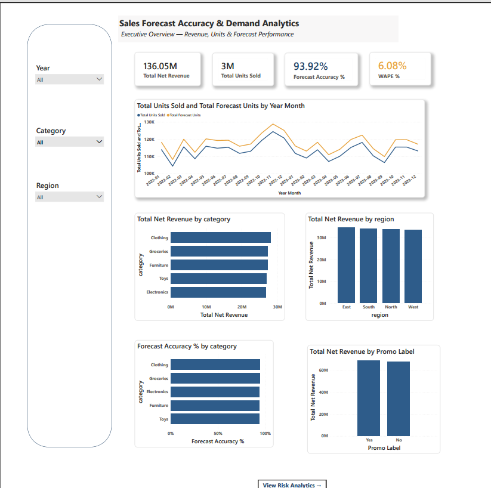
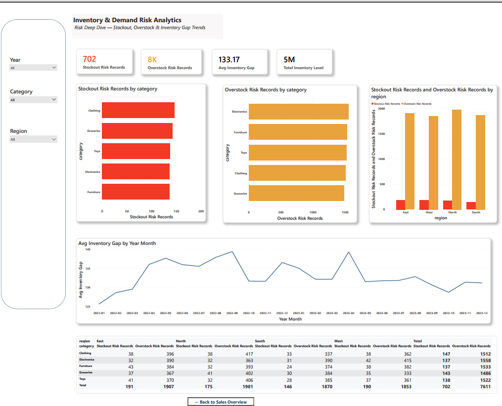

# Sales Forecast Accuracy & Demand Risk Analytics Dashboard

A 2-page Power BI dashboard analyzing retail sales performance, forecast accuracy, and inventory risk across categories, regions, and time — built on top of SQL-driven data analysis and cleaning.

## Problem Statement

Retail businesses need to understand not just what they're selling, but how accurately they're forecasting demand — and where inventory risk (stockouts and overstocking) is concentrated. This project answers:
- How accurate are our sales forecasts, and where do they break down?
- Which categories and regions drive the most revenue?
- Where is inventory risk highest, and how has it changed over time?
- Do promotions measurably impact sales?

## Tools Used
- **MySQL** — database design, data import, analytical querying
- **SQL** — data cleaning, forecast accuracy calculations, inventory risk logic, analytical view creation
- **Power BI Desktop** — report building, data modeling, DAX measures
- **DAX** — Forecast Accuracy %, WAPE %, Stockout/Overstock Risk, Avg Inventory Gap
- **Power Query** — data transformation

## Data & SQL Work

- Cleaned a retail dataset of 20,000 records (20 products, 5 stores, 5 categories) loaded into a MySQL database (`sales_forecast_db`)
- Identified and corrected 673 negative demand forecast values (replaced with 0, since negative demand has no business meaning)
- Calculated **Forecast Error**, **Absolute Forecast Error**, and **WAPE** (Weighted Absolute Percentage Error) in SQL to measure forecast accuracy: overall WAPE of 6.08%, translating to 93.92% forecast accuracy
- Built an **Inventory Gap** metric (Inventory Level − Demand Forecast) to classify records as Stockout Risk, Balanced, or Overstock Risk
- Analyzed forecast accuracy and stockout risk broken down by category and store to identify where forecasting and inventory planning needed the most attention
- Discovered that `product_id` alone wasn't unique across categories, and created a composite **Product Key** (Product ID + Category) for accurate product-level analysis
- Compiled all analytical logic into a single SQL view (`vw_sales_forecast_analysis`) — pushing business logic to SQL rather than recalculating it in Power BI — then connected this view directly to Power BI via the MySQL connector

## Dashboard Pages

### Page 1: Sales Forecast Accuracy & Demand Analytics
Executive overview covering net revenue, units sold, forecast accuracy, and WAPE, with breakdowns by category, region, and promotion impact.

### Page 2: Inventory & Demand Risk Analytics
Deep dive into stockout and overstock risk by category and region, inventory gap trends over time, and a category x region risk matrix.

## Key Features
- SQL-driven analytical layer feeding directly into Power BI (business logic built once, in SQL — not recalculated in DAX)
- Custom DAX measures for forecast accuracy and inventory risk scoring
- Interactive slicers (Year, Category, Region) synced across visuals
- Custom tooltip page showing category-level revenue trends on hover
- Page navigation buttons between report pages
- Consistent, professional color theme applied across both pages

## Key Insights
- Overall forecast accuracy is 93.92% (WAPE 6.08%) — a strong result, with Clothing forecasting most accurately (94.04%) and Toys least accurately (93.83%) among categories.
- Clothing carries the highest stockout risk record count, while Electronics shows the highest overstock risk, suggesting category-specific inventory strategies are needed rather than a one-size-fits-all approach.
- Promotion/holiday periods showed slightly higher average units sold and total revenue, alongside a marginally lower average forecast error — indicating promotions don't meaningfully hurt forecast reliability.
- Revenue is fairly evenly distributed across regions, with no single region dramatically outperforming the others.

## Files in This Repo
- `sales-forecast-risk-dashboard.pbix` — full interactive Power BI file
- `dashboard-export.pdf` — static PDF export of both pages
- `page1-sales-overview.png`, `page2-risk-analytics.png` — page screenshots
